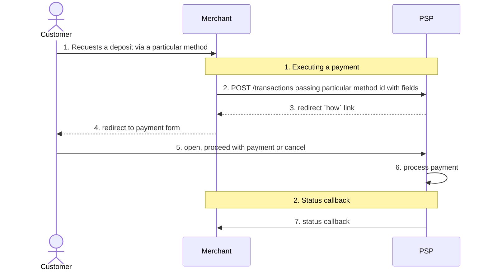
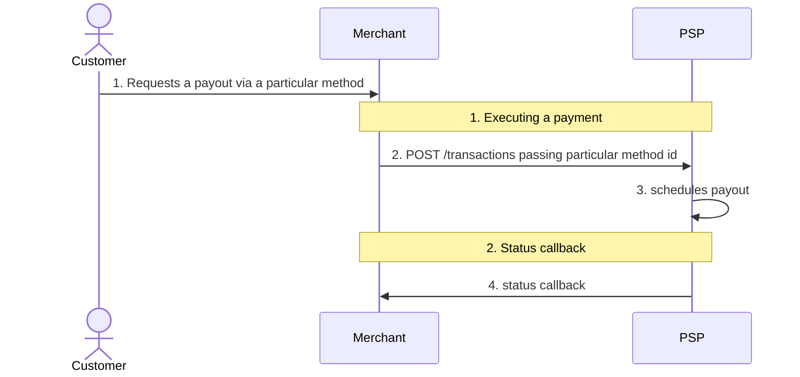

# Integration process

Hello! This is documentation for production environment.

1.  [Overview](#overview)
2.  [Integration Credentials](#integration-credentials)
3.  [Integration Process](#integration-process)
    - [Merchant Onboarding and Integration Steps](#sequence-of-steps)
    - [Integration diagram](#integration-diagram)
    - [Check before starting to work in Prod Environment](#check-before-starting-to-work-in-prod)
    - [Sequence diagram for deposit](#sequence-diagram-for-deposit)
    - [Sequence diagram for remit](#sequence-diagram-for-payout)
4.  [Get Available Payment Methods](#get-info-by-payment-methods)
5.  [Initiate Transaction](#initiate-transaction)
    - [Deposit Transaction](#deposit-transaction)
    - [Remit Transaction](#payout-transaction)
6.  [Get Transaction Status](#get-transaction-status)
7.  [Transaction Status Callback](#transaction-status-callback)
    - [Deposit Transaction Status Callback](#transaction-status-callback-for-deposit)
    - [Remit Transaction Status Callback](#transaction-status-callback-for-remit)
8.  [How to make a Refund](#how-to-make-a-refund)
9.  [Get Merchant Account Balance](#how-to-check-balance-merchant-cabinet)
10. [Get Transaction History (CSV)](#get-a-list-of-transactions)

## Overview

This document provides a detailed guide on direct Host-to-Host integration with the APS API. It outlines the interaction between parties for processing deposit and remit payments.

Participants:

- **Customer** - The end user who makes a deposit or receives a payment (remit) from the merchant
- **Merchant** - Your company
- **H2H-Backend** - The APS backend system

There are two available transaction flows:

- Deposit Flow – The process where customers make payments to the merchant.
- Remit Flow – The process where the merchant remits funds to the customer.

In this guide, the terms remit and payout are used interchangeably to refer to transactions where funds are transferred from the merchant to the customer.

## Integration Credentials

During the onboarding process, you will receive a set of credentials to access the APS API for both staging and production environments. APS API uses token-based authentication.

**Required Authentication Headers**

Every API request must include the following headers:

- App Token – Passed in the `X-App-Token` header.
- App Secret – Passed in the `X-App-Secret` header.

Requests missing these credentials will be rejected.

**Other API Credentials**

- Merchant GUID – A unique identifier for the merchant, used in the API endpoint path as `merchantGUID`.
- Callback Secret Key – Used to validate callback requests from APS. Status callbacks include a request signature for verification.

**Environment-Specific URLs**

- Staging Environment: <https://fpf-api.armenotech.net>
- Production Environment: <https://fpf-api.proc-gw.com>

Each environment has its own credentials, so ensure you use the correct set when switching between staging and production.

## Integration Process

### Merchant Onboarding and Integration Steps

1.  Agreement on Payment Methods, Countries, and Limits

You (the Merchant) and APS agree on the supported payment methods, geographic regions, and transfer limits. For information regarding limits and geographical coverage, please contact your account manager.

1.  Receiving Credentials for the Staging Environment

We will provide you with credentials for the Staging Environment via a one-time link sent to your email.

1.  Verifying Credentials

Before making any API requests, ensure that the tokens associated with your merchantGUID match the credentials provided. Please verify these credentials with the APS team before proceeding.

1.  Familiarizing Yourself with the API and Testing

Review this document and proceed with testing:

- Start by [retrieving all available payment methods](#get-info-by-payment-methods). Use the relevant API request to receive an array of payment methods available to you. The response will include details such as currency, fees, and limits for each method.
- Make 1 or 2 test transactions and test a refund process. Refer to the [How to make a Refund](#how-to-make-a-refund) section for guidance.

5.  Transition to the Production Environment

After successfully completing the tests and signing all necessary documents, you can finalize the settings. At this point, we will send you credentials for the Production Environment.

*Note:* The credentials for the Production Environment differ from those for the Staging Environment.

1.  Using the Production Environment

The API requests will function the same way in the Production Environment. You will receive a separate document containing the necessary credentials, links, and guides for production use.

1.  Access to the Merchant Portal

- You will also gain access to the Merchant Portal, where you can log in using the email address where you received your credentials.
- For detailed instructions on how to use the Merchant Portal, please refer to the Merchant Portal Guide.

### Integration Diagram

<!-- source: steps.png -->
1. Agreements about payment methods, countries, and the limits of transfers.
2. Credentials for the Stage environment, delivered as a one-time link by email.
3. Test on the staging environment.
4. Credentials for the Prod environment, delivered as a one-time link by email.
5. Test on the Prod environment.
6. After APS confirms the integration is done, traffic can start.

### Check-list before Go Live

1.  **Access to Failure Reasons** Ensure that your operations team has access to the `external_message` field in the callback. This field contains the reason for transaction failures, which can help minimize the number of support requests to us.

2.  **Traffic Launch Notification** Notify us at least 1 day in advance before launching live traffic. Do not initiate traffic without our approval.

3.  **Support After Integration**

    - Once integration is complete, you will have access to the Support Portal, where your operations team can resolve issues in the Production environment.

    - To obtain access to the support portal, provide your account manager with the email addresses of your employees.

    - For any inquiries related to live traffic, please use the Support Portal. Before reaching out, check the provided links to identify error causes:

      - [Portal](https://armenotech.atlassian.net/servicedesk/customer/kb/view/959840305) for deposit transactions

      - [Portal](https://armenotech.atlassian.net/servicedesk/customer/article/1311867029) for remit transactions.

### Sequence Diagram for Deposit

<!-- source: Sequence_Diagram_For_Deposit.png -->


The happy-path flow is as follows:

1.  **Customer Initiates Deposit**: A customer initiates a deposit request using a specific payment method, typically accessed through a button or link on the merchant's website or application.

2.  **Merchant Submits Transaction Data**: The merchant submits the transaction details to the payment system.

3.  **PSP Sends Payment Link**: The Payment Service Provider (PSP) generates a payment link and sends it to the merchant.

4.  **Customer Redirected to Payment Form**: The merchant redirects the customer to the payment form via the provided link.

5.  **Customer Redirected Back to Merchant**: After successfully registering the deposit, the H2H system redirects the customer back to the merchant’s website.

6.  **PSP Sends Callback with Transaction Result**: The PSP processes the payment and sends an HTTP callback to the merchant containing the transaction result. Refer to the [Get Transaction Status](#step3) chapter for more details.

### Sequence Diagram for Remit

<!-- source: Sequence_Diagram_For_Payout.png -->


The happy-path flow is as follows:

1.  **Customer Initiates Remit**: A customer initiates a remit request using a specific payment method, typically accessed through a button or link on the merchant's website or application.

2.  **Merchant Submits Transaction Data**: The merchant submits the transaction details to the payment system.

3.  **Customer Redirected Back to Merchant**: After successfully registering the remit, the Payment Service Provider (PSP) redirects the customer back to the merchant’s website.

4.  **PSP Sends Callback with Transaction Status**: The PSP processes the remit and sends an HTTP callback to the merchant with the transaction status. Refer to the [Get Transaction Status](#step3) chapter for more details.

## Get Available Payment Methods

The `GET /info` request retrieves information about available payment methods and their associated payment details. By making this request, you can obtain all the necessary information regarding the connected payment methods.

Example request:

**Get payment methods**

``` bash
curl https://fpf-api.proc-gw.com/api/v3/merchantGUID/info \
        --header 'X-App-Token: APP_KEY'
        --header 'X-App-Secret: APP_SECRET'
        
```

Example response:

``` text
  {
    "methods": [
      {
        "guid": "c8e18874-ce90-4a6a-86cd-bcd17f815476:d93717d0-86d0-435a-8191-ea1b43d04a96",
        "fee_fixed": 0,
        "fee_percent": 0,
        "customer_fee_percent": 0,
        "customer_fee_fixed": 0,
        "min_amount": 1.43,
        "max_amount": 570.72,
        "label": "EUR",
        "logo_url": "https://fpf-assets.armenotech.com/mastercard.svg",
        "mobile_logo_url": "https://fpf-assets.armenotech.com/mastercard.svg",
        "payment_group": "BANKCARD",
        "payment_group_name": "Bank card",
        "digits_delivery": 2,
        "digits_asset": 2,
        "rate": 1.4,
        "delivery_currency": "iso4217:EUR",
        "method_currency": "BRL",
        "method_symbol": "R$",
        "country_code": "WWC",
        "direction": "in"
        "deposit": {
          "guid": "c8e18874-ce90-4a6a-86cd-bcd17f815476:d93717d0-86d0-435a-8191-ea1b43d04a96",
          "fields": {
            "external_id": {
              "optional": true,
              "description": "Merchant’s external ID",
              "hidden": true
            },
            "redirect_url": {
              "optional": true,
              "description": "url where a customer will be redirected with parameters status=[successful|failed|canceled], transaction_id, method, amount, currency",
              "hidden": true,
            },
            "status_callback_url": {
              "optional": true,
              "description": "Callback URL",
              "hidden": true
            }
          },
        }
      }
     ]
 }
```

The response is an array of available payment methods. Each method includes detailed information about the payment currency, fees, and limits.

| Name | Description |
|----|----|
| `guid` | Payment method guid |
| `fee_fixed` | Fixed fee according to the contract with the merchant |
| `fee_percent` | Percent fee according to the contract with the merchant |
| `customer_fee_percent` | Percent fee to be paid by an end user according to the contract with the merchant |
| `customer_fee_fixed` | Fixed fee to be paid by an end user according to the contract with the merchant |
| `min_amount` | Minimum possible amount per transaction |
| `max_amount` | Maximum possible amount per transaction |
| `label` | Method Label |
| `logo_url` | Method Logo |
| `mobile_logo_url` | Mobile method logo |
| `payment_group` | Additional information on the method |
| `payment_group_name` | Additional information on the method |
| `digits_delivery` | Number of significant digits for delivery currency |
| `digits_asset` | Number of significant digits for asset |
| `rate` | Conversion rate of asset to delivery currency |
| `delivery_currency` | Currency code |
| `method_currency` | The currency in which all amounts are calculated using this method |
| `method_symbol` | Currency symbol (may be missing) to display to the client |
| `country_code` | Country code |
| `direction` | Two input/output values are possible. They say in which direction the payment takes place in = deposit, out = remit |
| `deposit/remit` | The object containing the fields of the payment method is called deposit/remit |
| `fields` | An object that lists the fields required for transfer within each payment method. The required fields may vary even within the same payment method, so we recommend making a `/info` request before each payment to ensure you collect the correct fields. |
| `field.optional` | If true, the parameter is not required to be filled in |
| `field.description` | Description of the field |
| `field.hidden` | Recommendation whether to hide this field from customer |

## Initiate Transaction

### Deposit Transaction

In the example request below, you can see how to initiate deposit transactions:

Example request with the required fields:

**Initiate transaction**

``` bash
curl POST https://fpf-api.proc-gw.com/api/v3/merchantGUID/transactions \
--header 'Content-Type: application/json'
--header 'X-App-Token: {APP_KEY}'
--header 'X-App-Secret: {APP_SECRET}'
--data-raw '{
      "amount": 100.2,
      "fields": {
          "transaction": {
              "deposit_method": "06d34870-a9d3-4baa-afce-995c1f385d1d:81180240-65f1-4ed0-9f1f-be1e0b4fa985"
          }
      }
  }'
        
```

You can get the list of optional fields making [Get Available Payment Methods](#get-info-by-payment-methods) request.

Example request with the optional fields:

**Initiate transaction with optional fields**

``` bash
curl POST https://fpf-api.proc-gw.com/api/v3/merchantGUID/transactions \
--header 'Content-Type: application/json'
--header 'X-App-Token: {APP_KEY}'
--header 'X-App-Secret: {APP_SECRET}'
--data-raw '{
      "amount": 100.2,
      "fields": {
          "transaction": {
              "deposit_method": "06d34870-a9d3-4baa-afce-995c1f385d1d:81180240-65f1-4ed0-9f1f-be1e0b4fa985",
              "deposit": {
                      "redirect_url": "https://www.google.com",
                      "status_callback_url": "https://fast-payment-flow-merchant.armenotech.dev/94b9f3ed-ee84-4789-8c4b-41ee8c61ad41/transactions",
                      "external_id": "external transaction identifier, string",
                      "payer_id": "external payer identifier, string",
                      "customer_ip_address": "93.109.244.86",
                      "from_country": "GB",
                      "from_last_name": "Smith",
                      "from_first_name": "John",
                      "billing_street": "Test street",
                      "billing_town": "London",
                      "billing_post_code": "0839",
                      "from_email": "customer@gmail.com",
                      "referer_domain": "www.externalwebsite.com",
                      "locale_lang": "es"
              }
          }
      }
  }'
        
```

When making a request to create a transaction, it is important to ensure the correct nesting of fields in the request body.

| Name | Description |
|----|----|
| `amount` | The total amount of the transaction, represented in the currency of the payment method, must be a positive number. |
| `deposit_method` | A unique identifier for the payment method. Retrieve the available payment methods using the [Get Available Payment Methods](#get-info-by-payment-methods) request. |
| `deposit` | An object containing the details of the transaction. This includes fields necessary for processing. |
| `status_callback_url` | The URL to which callback requests will be sent when the transaction status changes. Ensure that this endpoint is publicly accessible and capable of handling incoming requests for proper notification of status updates. |
| `redirect_url` | A URL to which the customer will be redirected upon completion of the deposit. This field is applicable only to deposit transactions. Note that some payment methods may not support redirection. |
| `external_id` | The merchant's unique identifier for the transaction. It is a string of up to 96 characters. Uniqueness across all transactions is not required. |
| `payer_id` | An identifier for the payer within the merchant's internal system. It is a string of up to 96 characters. Uniqueness across transactions is not required. |
| *Transaction Processing Recommendations* | For improved transaction processing, we recommend submitting all relevant fields in full, ensuring they contain accurate and reliable information about the client: |
| `customer_ip_address` | The IPv4 or IPv6 address of the customer's device. |
| `from_last_name` | The last name of the customer. It is a string with 2 to 32 characters, which may include spaces, dots, dashes, or ampersands. |
| `from_first_name` | The first name of the customer. It is a string with 2 to 32 characters, which may include spaces, dots, dashes, or ampersands. |
| `from_country` | The country from which the transaction is being made. ISO 3166 country names, alpha-2 or alpha-3 country codes. |
| `billing_street` | The street address provided by the customer when opening their bank account. Must contain 2-100 characters. |
| `billing_town` | The town provided by the customer when opening their bank account. It is a string with 2 to 32 characters, which may include spaces, dots, dashes, or ampersands. |
| `billing_post_code` | The postcode provided by the customer when opening their bank account. Must contain 0-20 characters. |
| `from_email` | The email address provided by the customer when opening their bank account. Must contain 0-100 characters. |
| `referer_domain` | The domain of the original URL from which the transaction request originated. Used to identify the website or application that directed the user to complete the payment. |
| `locale_lang` | An ISO 639-1 language code to set the localization of [the checkout form](#checkout-form). Supported languages: en - English, es - Spanish, pt - Portuguese, de - German, fr - French. |

*Note:* The IP address and email must belong to the user, be consistent for one card, and should not be the same across all traffic transactions or GEO locations. The billing address must, at a minimum, contain the user’s actual country and postal code. The billing address country for each issuer must match the issuer’s country.

Example deposit response:

``` text
  {
      "id": "1a2d87dc-3a6e-48dd-be69-8ad6492cc8b4",
      "amount": 1000,
      "amount_in": 1000,
      "customer_fee": 0,
      "contract_fee": 0,
      "merchant_fee": 0,
      "amount_out": 1000,
      "amount_body": 1000,
      "how": "https://cert.monnetpayments.com/api-payin/payment/voucher/27685?verification=4bdf290c8145af72f75c7fcefb99f33f5ac29eac7071d5dacf03e518e895a4f3d8e91dc803af10195f00ee0c58d7e4c6091ed2c8cfaa631d953bcae250a132d0",
      "extra_info": {
          "displayed_fields": [
              "is_redirect"
          ],
          "external_transaction_id": "1a2d87dc-3a6e-48dd-be69-8ad6492cc8b4",
          "is_redirect": "true",
          "transaction_id": "1a2d87dc-3a6e-48dd-be69-8ad6492cc8b4"
      }
  }
```

In response you will get the following:

| Name | Description |
|----|----|
| `id` | Unique identifier for the transaction. |
| `amount` | Total amount of the transaction, including any applicable fees. |
| `amount_in` | The total amount paid by the customer. |
| `customer_fee` | The fee charged to the customer based on the merchant's contract terms. |
| `contract_fee` | The fee charged by APS according to the terms of the merchant's contract. |
| `merchant_fee` | The calculated fee according to the merchant's contract. This fee is retained by the merchant and can be negative if the merchant opts to compensate the customer's fee. |
| `amount_out` | The final amount settled to the merchant's account by APS after deducting any applicable fees. |
| `amount_body` | The amount of the payment excluding any commissions or fees. |
| `amount_in` | Amount that a customer pays |
| `how` | External URL to the checkout form. The merchant's application redirects the customer to this external system for payment confirmation and execution. |
| `external_transaction_id` | The transaction identifier in the external payment system. For Binance, this field contains the APS transaction identifier. |
| `is_redirect` | Flag indicating if the customer was redirected to an external payment system. |
| `merchant_external_id` | The transaction ID from the merchant, as received in the `/transactions` request under `external_id` |

**Note**: If you get a response that is not 200 OK, you can ask the integration team what is the problem.

#### Handling the "how" field

##### Redirect to checkout form

Redirecting to the checkout form is required for payment methods where the customer must complete the payment via a web form. In this case, the `how` field contains a link to the web form where the customer provides payment details.

The merchant’s application should redirect the customer to the checkout form using the URL received in the `how` element of the `/transactions` response.

For example: `https://app.payment.com/payment/secpay?linkToken=793c9fb78be54d898a041d370303c8c7&_dp=Ym5jOi8vYXBwLmJpbmFuY2UuY29tL3BheW1lbnQvc2VjcGF5P3RlbXBUb2tlbj1CYVpqdmZoWDI0NUcyaWF5UGV0TVFReURMeWF6SnM2SSZyZXR1cm5MaW5rPWh0dHBzOi8vc3RhZ2UtNWNjODdlZjgtY2NkNy00Nzc0LTg2ZTAtNDViNTE1MzQ5MjVjLXBheW1lbnRkcml2ZXIuYXJtZW5vdGVjaC5uZXQvcmVkaXJlY3Q_dHJhbnNhY3Rpb25fZ3VpZD05NDk0NmM2Ny0zODk1LTRiYjEtODg4Yi1lNzNlNzM0YWNmNDYmY2FuY2VsTGluaz1odHRwczovL3N0YWdlLTVjYzg3ZWY4LWNjZDctNDc3NC04NmUwLTQ1YjUxNTM0OTI1Yy1wYXltZW50ZHJpdmVyLmFybWVub3RlY2gubmV0L3JlZGlyZWN0P3RyYW5zYWN0aW9uX2d1aWQ9OTQ5NDZjNjctMzg5NS00YmIxLTg4OGItZTczZTczNGFjZjQ2`

You will need to take the “how” link from the response and redirect customer to checkout form:

<!-- source: hosted_page.png -->
The APS-hosted card form: a "Card details" panel warning that if the card
currency differs from the payment currency the customer's bank may charge a
conversion fee, above four fields — Card Number, Cardholder Name, MM/YY, and
CVV/CVC.

The customer will enter the card details.

##### Direct post of bank card data

The APS bank card payment method supports the direct posting of payment details, including the card number, cardholder name, expiry date, and CVV/CVC. To process an APS bank card deposit, make a POST request to the URL provided in the how field with the customer’s payment details.

When using the bank card payment method, you can directly transfer the payment details to us.

``` json
Content-Type: application/json
```

Request example:

``` text
 curl 'https://form.pci-gw.com/payment/TRANSACTION_ID/merchantGUID'   
  -H 'Content-Type: application/json'   
  --data-raw '{
    "number": "4111111111111111",
    "holder": "John Doe",
    "exp_month": 10,
    "exp_year": 25,
    "csc": "010"
  }
```

Request fields:

| Name | Type | Description |
|----|----|----|
| `number` | `string` | The bank card number. |
| `holder` | `string` | Name of the cardholder as it appears on the card. |
| `exp_month` | `int` | Expiration month of the card (1-12). |
| `exp_year` | `int` (last 2 digits) | Last two digits of the card's expiration year. |
| `csc` | `string` (3 digits) | The 3-digit CVC/CVV security code from the back of the card. |
| `from_api` | `boolean` | Indicates the 3D Secure process: if `false`, the customer will be redirected to a 3D Secure page; if `true`, a link to the 3D Secure page will be provided in the `auth_3d_url` attribute of the response. |

Success response example:

``` text
200
{
  "status": "success",
  "auth_3d_url": "https://some3ds.com"
}
```

| Name | Type | Description |
|----|----|----|
| `auth_3d_url` | `string` (url, optional) | The URL for 3D Secure (3DS) authentication. The customer should be redirected to this URL to complete the 3DS verification process. |

Fail response example:

``` text
400
{
  "status": "fail",
  "retryable": false,
  "external_status": "something_went_wrong",
  "external_message": "We weren't able to process your transaction."
}
```

**Possible cases**

| Case | Status code | Retryable | Example response |
|----|----|----|----|
| Request success and transaction went with 3Ds flow. | 200 | `false` | `{ "auth_3d_url": "https://example.com/auth_3d_url", "redirect_url": "https://example.com/redirect_url", "status": "success" }` |
| Request success and 2d flow | 200 | `false` | `{ "auth_3d_url": "https://example.com/auth_3d_url", "redirect_url": "https://example.com/redirect_url", "status": "success" }` |
| Invalid order state | 400 | `false` | `{ "auth_3d_url": null, "redirect_url": "", "status": "fail", "retryable": false, "external_status": "something_went_wrong", "external_message": "We weren't able to process your transaction." }` |
| Bad request (Invalid request format) | 400 | `false` | `{ "auth_3d_url": null, "redirect_url": "", "status": "fail", "retryable": false, "external_status": "something_went_wrong", "external_message": "We weren't able to process your transaction." }` |
| Card holder is empty | 400 | `true` | `{ "auth_3d_url": null, "redirect_url": "", "status": "fail", "retryable": true, "external_status": "card_holder_is_empty", "external_message": "Card holder field is empty." }` |
| Card expired | 400 | `true` | `{ "auth_3d_url": null, "redirect_url": "", "status": "fail", "retryable": true, "external_status": "card_is_expired", "external_message": "Your card has expired." }` |
| Invalid expire month | 400 | `true` | `{ "auth_3d_url": null, "redirect_url": "", "status": "fail", "retryable": true, "external_status": "invalid_card", "external_message": "Invalid card details." }` |
| Invalid CSC | 400 | `true` | `{ "auth_3d_url": null, "redirect_url": "", "status": "fail", "retryable": true, "external_status": "invalid_card", "external_message": "Invalid card details." }` |
| Invalid card number length | 400 | `true` | `{ "auth_3d_url": null, "redirect_url": "", "status": "fail", "retryable": true, "external_status": "invalid_card_number_length", "external_message": "Invalid card number length." }` |
| Invalid card number check digit value | 400 | `true` | `{ "auth_3d_url": null, "redirect_url": "", "status": "fail", "retryable": true, "external_status": "invalid_card", "external_message": "Invalid card details." }` |
| Service Error | 400 | `false` | `{ "auth_3d_url": null, "redirect_url": "", "status": "fail", "retryable": false, "external_status": "something_went_wrong", "external_message": "We weren't able to process your transaction." }` |
| Provider Error (Error while processing request) | 400 | `false` | `{ "auth_3d_url": null, "redirect_url": "", "status": "fail", "retryable": false, "external_status": "external_error", "external_message": "Invalid response from bank." }` |
| Visa not allowed | 400 | `false` | `{ "auth_3d_url": null, "redirect_url": "", "status": "fail", "retryable": false, "external_status": "visa_not_allowed", "external_message": "Bank card type Visa is not allowed." }` |
| Card user not authorized for payment | 400 | `false` | `{ "auth_3d_url": null, "redirect_url": "", "status": "fail", "retryable": false, "external_status": "verification_error", "external_message": "Payment verification has failed." }` |
| Insufficient funds | 400 | `false` | `{ "auth_3d_url": null, "redirect_url": "", "status": "fail", "retryable": false, "external_status": "insufficient_funds", "external_message": "Insufficient funds on the card balance." }` |

**Note**: you don't need "how" field for remit payments, as you have already provided the card number during the initiation step.

If you have successfully made a request, you can check the transaction status in two ways:

- Waiting for the callback: you can learn information about the callbacks [here](#step4).

- Making a status request:: you can learn information about the requests [here](#step3).

### Remit Transaction

**Note**: to initiate a remit transaction, you must have sufficient funds in your balance. Please remember to top up your balance via the financial chat. We will provide you with access to this chat.

**Note**: for testing remit transactions in the Staging Environment, we will top up your balance.

To ensure you have all the required fields, please refer to the section on [Get Available Payment Methods](#get-info-by-payment-methods)

Example of bank card remit transaction request:

**Initiate transaction for remit**

``` bash
curl POST https://fpf-api.proc-gw.com/api/v3/merchantGUID/transactions \
--header 'Content-Type: application/json'
--header 'X-App-Token: {APP_KEY}'
--header 'X-App-Secret: {APP_SECRET}'
--data-raw '{
      "amount": 100.2,
      "fields": {
          "transaction": {
              "remit_method": "06d34870-a9d3-4baa-afce-995c1f385d1d:81180240-65f1-4ed0-9f1f-be1e0b4fa985",
              "remit": {
   "external_id": "merchant_external_id_string",
   "payer_id": "merchant_payer_id_string",
   "customer_ip_address": "93.109.244.86",
   "referer_domain": "www.externalwebsite.com",
   "redirect_url": "https://www.yourswebsite.com/redirect",
   "status_callback_url": "https://www.yourswebsite.com/callback",
   "from_country": "USA",
   "to_bank_card": "2222444422224444",
   "to_bank_card_exp": "12/31"
              }
          }
      }
  }'
        
```

When making a request to create a transaction, it is crucial to ensure that the correct nesting of fields is maintained in the request body.

| Name | Description |
|----|----|
| `amount` | The base amount of the transaction, excluding any fees or commissions. |
| `remit_method` | The payment method identifier (GUID). You can obtain this by making a request for [Get Available Payment Methods](#get-info-by-payment-methods). |
| `remit` | An object containing additional fields related to the transaction, such as payment details. |
| `status_callback_url` | The URL where callback requests will be sent when the transaction status changes. |
| `redirect_url` | The URL to which the customer will be redirected after the deposit is completed. This applies only to deposit transactions, and note that some payment methods may not support redirection.. |
| `external_id` | The merchant's transaction ID, which can be up to 96 characters long. This ID is not required to be unique across all of the merchant's transactions. |
| `payer_id` | The payer's identifier in the merchant's internal system, up to 96 characters long. This ID is not required to be unique across the merchant's transactions. |
| `referer_domain` | The domain of the original URL from which the transaction request originated. Used to identify the website or application that directed the user to complete the payment. |

Example of remit transaction response:

``` text
{
      "id": "dfba9a85-464f-4f88-9afc-865296bca4ef",
      "amount": 103.7,
      "amount_in": 103.7,
      "customer_fee": 0,
      "contract_fee": 3.7,
      "merchant_fee": 3.7,
      "amount_out": 100,
      "amount_body": 100,
      "extra_info": null
}
```

## Get Transaction Status

You can request the transaction status via the API using the transaction ID.

Example request:

**Get Status Transaction**

``` bash
curl https://fpf-api.proc-gw.com/api/v3/merchantGUID/TRANSACTION_ID \
        --header 'X-App-Token: APP_KEY'
        --header 'X-App-Secret: APP_SECRET'
        --header 'Content-Type: application/json'
        
```

Example response:

``` text
{
    "id": "f2a86886-675c-4f55-a247-757a4ef55e53",
    "external_id": "test 2434",
    "status": "completed",
    "refunded": true,
    "amount": 3,
    "amount_in": 3,
    "amount_out": 3,
    "amount_fee": 0,
    "amount_body": 3,
    "customer_fee": 0,
    "merchant_fee": 0,
    "external_message": "APPROVED",
    "fiscal_status": "done",
    "refunds": {
        "amount_refunded": "3",
        "amount_fee": "0",
        "payments": [
            {
                "id": "ee9de236-6f6a-48b7-b1ad-bb496e6ba5dc",
                "external_id": "{YOUR_REFUND_EXTERNAL_ID}",
                "status": "completed",
                "fiscal_status": "refunded",
                "amount": 3,
                "rrn": "688447"
            }
        ]
    }
}
```

A JSON object containing the following fields:

| Name | Type | Optional | Description |
|----|----|----|----|
| `id` | `UUID` | `true` | Unique identifier for the transaction. |
| `merchant_external_id` | `string` | `true` | External transaction ID provided by the merchant. |
| `status` | `string enum` | `true` | Current status of the transaction. Possible values include: |
|  | `pending_sender`: awaiting payment from the customer. |  |  |
|  | `pending_external`: The customer has made a payment, and the transaction is under AML-check (Anti-Money Laundering). Alternatively, the merchant has initiated a refund, and the refund is pending completion. |  |  |
|  | `completed`: The transaction has been successfully completed. |  |  |
|  | `error`: There was an error processing the transaction. |  |  |
|  | `pending_transaction_info_update`: An error occurred during transaction initiation. This status should be interpreted as an error. |  |  |
| `fiscal_status` | Indicates the current status of the operation. Possible values include: | yes |  |
|  | `pending`: Operation is in progress. |  |  |
|  | `canceled`: Operation was canceled. |  |  |
|  | `expired`: Payment was not completed in time, and the operation expired. |  |  |
|  | `done`: Operation completed. |  |  |
|  | `failed`: (For Payouts only) Unable to complete the operation due to lack of funds or error. |  |  |
| `amount` | `float` | `false` | The total transaction amount as specified in the request. |
| `refunded` | `bool` | `true` | Indicates if the transaction was refunded. |
| `amount_in` | `float` | `true` | The amount paid by the sender. In deposit transactions, this is the amount the customer has paid in the contract currency. In remit transactions, this is the amount charged to execute the transaction. |
| `amount_out` | `float` | `true` | The received amount. In deposit transactions, this is the amount credited to the merchant. In remit transactions, this is the amount credited to the customer. |
| `amount_fee` | `float` | `true` | The fee charged based on the contract. |
| `customer_fee` | `float` | `true` | The fee paid by the customer, as calculated per the contract. |
| `merchant_fee` | `float` | `true` | The fee paid or earned by the merchant. A positive value means the merchant owes the fee, while a negative value means the merchant benefits. |
| `refunds.amount_refunded` | `float` | `true` | The amount refunded from the transaction. |
| `refunds.amount_fee` | `float` | `true` | The fee charged on the refunded amount, according to the contract. |
| `refunds.payments[?].id` | `UUID` | `true` | Unique identifier for the refund. |
| `refunds.payments[?].external_id` | `string` | `true` | External refund ID provided by the merchant during the refund creation request. |
| `refunds.payments[?].status` | `string enum` | `true` | Status of the refund. Possible values include: |
|  | `pending`: A request has been sent to the acquiring bank to initiate the refund. Status updates will be provided upon receiving feedback. |  |  |
|  | `completed`: The transaction has been fully refunded. |  |  |
|  | `rejected`: The refund request was rejected |  |  |
| `refunds.payments[?].fiscal_status` | The current status of the refund operation. May be one of the following: | yes |  |
|  | `pending`: Operation is in progress. |  |  |
|  | `failed`: Unable to complete the operation due to lack of funds or error. |  |  |
|  | `refunded`: Refund operation completed. |  |  |
| `refunds.payments[?].amount` | `float` | `true` | The refund amount including any applicable fees based on the contract. |
| `refunds.payments[?].rrn` | `string` | `true` | Retrieval Reference Number (RRN), an identifier for the refund provided by the payment provider. |

## Transaction Status Callback

**Before Going Live**, ensure that your operations team has access to the external reason provided in the callback within the `external_message` field. This information is essential for understanding the reasons behind rejected transactions.

The transaction status callback is used to notify merchants about the transaction status following a payment operation.

The Payment Service Provider (PSP) requests the merchant's system by sending a request to the endpoint specified in the `status_callback_url` field of the /transactions request. The merchant's system should respond with a 200 OK status.

Transaction status defined by 2 elements `sep31_status` and `refunded`:

Successful transaction has `sep31_status` = `completed` and `refunded` = `false`

Refunded transaction has `sep31_status` = `completed` and `refunded` = `true`

Failed transaction has `sep31_status` = `error`

### Callback Security and Request Verification

To ensure that callback requests originate exclusively from our platform and have not been tampered with, webhook requests are signed using the **HMAC-SHA256** algorithm when a secret key is configured.

> ⚠️ **Deprecation Notice:** The legacy fields `md5_sig` and `md5_body_sig` passed within the JSON payload are now deprecated. It is highly recommended to migrate to the new `X-Signature` header validation described below.

Overview

- **Algorithm:** HMAC-SHA256
- **Signature Location:** Sent as a custom HTTP header named `X-Signature`.
- **Payload:** The signature is generated over the **raw bytes** of the entire incoming JSON request body.
- **Secret Key:** Use your unique Callback Secret Key obtained from the [Integration Credentials](#integration-credentials) section. If no secret key is configured for the your account, the `X-Signature` header will not be sent.

Signature Generation Formula

``` text
X-Signature =hex(HMAC-SHA256(secret_key,request_body))
```

Where:

- `request_body` — The raw, unparsed bytes of the JSON body.
- `secret_key` — Your unique secret key.

------------------------------------------------------------------------

Verification Code Examples

To prevent timing attacks, always use constant-time string comparison functions when validating the signature in your application.

Go

``` go
import (
    "crypto/hmac"
    "crypto/sha256"
    "encoding/hex"
)

// Verify checks if the incoming X-Signature header matches the computed HMAC
func Verify(body []byte, secret, headerSig string) bool {
    mac := hmac.New(sha256.New, []byte(secret))
    mac.Write(body)
    expected := hex.EncodeToString(mac.Sum(nil))
    
    return hmac.Equal([]byte(expected), []byte(headerSig))
}
```

### Deposit Callback

Example response:

``` text
  "payload": {
    "amount_body": 500,
    "amount_in": 500,
    "amount_out": 475.5,
    "asset": "stellar:APSUSDM:GB7OUO5NY5WQKXJJ7PFFZEJOKN4BA7IOEN3Z6SWAY26LGTREJJYZH2ZT",
    "body_currency": "iso4217:USD",
    "deposit_details": {
      "bank_card_mask": "471227******0407",
      "from_first_name": "Saurabh",
      "from_last_name": "Ghodmare",
      "payment_group": "bank_card",
      "payment_method": "r:fab9dcd0-bb93-4f09-b65f-2edb69a3a213"
    },
    "md5_body_sig": "30e93a687812eb759f867d55d77a064d",
    "md5_sig": "a99ec94e699e361fdb33aa50140e474b",
    "merchant_external_id": "202678449",
    "refunded": true,
    "refunds": {
      "amount_fee": "2",
      "amount_refunded": "8",
      "amount_refunded_to_customer": "6",
      "payments": [
        {
          "amount": 502,
          "fee": 2,
          "amount_body": 3,
          "id": "2a8bf37c-3d3d-4280-9e42-680c8ce6150a",
          "external_id": "{YOUR_REFUND_EXTERNAL_ID}",
          "rrn": "435307914502",
          "arn": "123456789123",
          "status": "completed",
          "fiscal_status": "refunded"
        }
      ]
    },
    "sep31_status": "completed",
    "seq": 1724999384570,
    "status": "refunded",
    "fiscal_status": "done",
    "transaction_id": "b829f009-afe0-45c2-9996-8941f80bcb0e"
  },
```

Request body contains the following elements:

| Field | Description | Required |
|----|----|----|
| `transaction_id` | Unique identifier for the PSP transaction. | yes |
| `body_currency` | Processing currency applicable between the merchant and PSP. | yes |
| `status` | Current status of the transaction. Possible values include: | yes |
|  | `canceled`: Transaction canceled by the payment provider. |  |
|  | `expired`: Payment not completed in time, transaction expired |  |
|  | `payed`: Payment completed by the customer, but the funds haven't yet settled to the PSP account |  |
|  | `done`: Transaction successfully completed. |  |
|  | `refund_pending`: Refund request sent to the acquiring bank, awaiting feedback on refund status. |  |
|  | `refunded`: Transaction fully refunded. |  |
|  | `refund_rejected`: Refund rejected. |  |
| `fiscal_status` | Indicates the current status of the deposit operation. Possible values include: | yes |
|  | `pending`: Operation is in progress. |  |
|  | `canceled`: Deposit was canceled. |  |
|  | `expired`: - Payment was not completed in time, and the operation expired. |  |
|  | `done`: Operation completed. |  |
| `md5_sig` | MD5 signature to validate callback request. `md5(transaction_id+status+secret_key)` **Deprecated!** Please use `X-Signature` header instead | yes |
| `seq` | Timestamp in UnixMilli format indicating when the callback was created. | yes |
| `sep31_status` | Status of the Sep31 transaction. Possible values: - completed - error | yes |
| `refunded` | Indicates whether the transaction has been refunded: `true`/`false` | yes |
| `refunds.amount_fee` | Fee associated with the refund according to the contract. | yes |
| `amount_refunded` | Amount to be refunded. | yes |
| `amount_refunded_to_customer` | The exact sum that will be send to customer | yes |
| `refunds.payments[?].amount` | Total amount to refund, including any applicable fees as per the contract. | yes |
| `refunds.payments[?].amount_body` | Amount that is due to the end customer | yes |
| `refunds.payments[?].fee` | Fee associated with the refund according to the contract. | yes |
| `refunds.payments[?].id` | Unique identifier (UUID) for the refund transaction. | yes |
| `refunds.payments[?].external_id` | External refund ID provided by the merchant during the refund request. | no |
| `refunds.payments[?].rrn` | Retrieval Reference Number, which is the refund identifier provided by the payment provider. | yes |
| `refunds.payments[?].arn` | Acquirer Reference Number, which is the refund identifier provided by the payment provider. | yes |
| `refunds.payments[?].status` | Refund status, which may be one of the following: | yes |
|  | `pending`: Refund request sent, awaiting feedback from the acquiring bank. |  |
|  | `completed`: Transaction fully refunded |  |
|  | `rejected`: Refund rejected. |  |
| `refunds.payments[?].fiscal_status` | The current status of the refund operation. May be one of the following: | yes |
|  | `pending`: Operation is in progress. |  |
|  | `failed`: Unable to complete the operation due to lack of funds or error. |  |
|  | `refunded`: Refund operation completed. |  |
| `md5_body_sig` | MD5 signature to validate callback request. `md5(transaction_id+sep31_status+refunded+secret_key)` **Deprecated!** Please use `X-Signature` header instead | yes |
| `deposit_details` | Detailed information about the deposit transaction. Specific payload depends on the payment method Examples are: | no |
|  | `{ "payment_group": "bank_card", "bank_card_mask": "1000****0001", "from_first_name": "Saurabh", "from_last_name": "Ghodmare", "payment_method": "r:fab9dcd0-bb93-4f09-b65f-2edb69a3a213"}` |  |
|  | `{ "payment_group": "bank_account"}` |  |
|  | `{ "payment_group": "ewallet","ewallet_account_id": "475846215"}` |  |
|  | `{ "binance_open_user_id": "8f825dd63a8dee291766c81cc4df5c62", "ewallet_account_id": "578144430", "payment_group": "ewallet" "payment_method": "a44ba598-bec9-439e-baef-4dc8b0ae2e4b:80210375-51a1-4ac7-8d83-d3b31857a818",` |  |
|  | `payment_group` field may be one of the following values: `bank_card`,`cash_collection`, `crypto`, `ewallet`,`bank_account` |  |
| `merchant_external_id` | External ID provided by the merchant in the original request. | no |
| `amount_in` | Amount the customer has paid. | yes |
| `amount_out` | Amount settled to the merchant’s account by the PSP. | yes |
| `external_status` | Status provided by the local payment provider | no |
| `external_message` | Error details provided by the local payment provider. | no |

### Remit Callback

Request example:

``` text
"payload": {
    "amount_body": 100.2,
    "amount_in": 100.2,
    "amount_out": 94.68,
    "asset": "stellar:PURPLE:GBT4VVTDPCNA45MNWX5G6LUTLIEENSTUHDVXO2AQHAZ24KUZUPLPGJZH",
    "body_currency": "iso4217:EUR",
    "payout_details": {
      "bank_card_mask": "401200******3010",
      "payment_group": "bank_card",
      "payment_method": "a7b5ac9a-dac2-46c7-919c-9e478e3daf62:1c032242-bc6f-4b0e-b8e9-7d3fca7a668f",
      "rrn": "435307914502"
    },
    "external_message": "The transaction was completed successfully",
    "md5_body_sig": "cee95760668eb0963ab1dc5304fb6046",
    "md5_sig": "6fc67e043cb47b3cd7066450959117fe",
    "merchant_external_id": "123321",
    "refunded": false,
    "sep31_status": "completed",
    "seq": 1724822157474,
    "status": "done",
    "fiscal_status": "done",
    "transaction_id": "07f62464-fcf1-47b3-a804-3af29b884134"
  },
```

Request body contains the following elements:

| Field | Description | Required |
|----|----|----|
| `transaction_id` | The Payment Service Provider (PSP) transaction ID. | yes |
| `body_currency` | Processing currency applicable between the merchant and PSP. | yes |
| `status` | The current status of the transaction. Possible values include: | yes |
|  | `expired`: The payment was not completed within the allotted time, and the transaction has expired. |  |
|  | `done`: The transaction was successfully completed. |  |
|  | `refunded`: The remit failed, and the funds were returned to the merchant. |  |
|  | `canceled`: Transaction canceled by the payment provider. |  |
| `fiscal_status` | The current status of the operation, which may be one of the following: | yes |
|  | `pending`: Operation is in progress. |  |
|  | `canceled`: Remit was canceled. |  |
|  | `expired`: Payment was not completed in time, and the operation expired. |  |
|  | `failed`: Unable to complete the operation due to lack of funds or error. |  |
|  | `done`: Operation completed. |  |
| `md5_sig` | MD5 signature to validate callback request. `md5(transaction_id+status+secret_key)` **Deprecated!** Please use `X-Signature` header instead | yes |
| `seq` | Unix timestamp in milliseconds at the moment the callback was created. | yes |
| `sep31_status` | Status of the Sep31 transaction, which can be one of the following: - completed - error | yes |
| `refunded` | Boolean value indicating whether the transaction was refunded: `true`/`false` | yes |
| `md5_body_sig` | MD5 signature to validate callback request. `md5(transaction_id+sep31_status+refunded+secret_key)` **Deprecated!** Please use `X-Signature` header instead | yes |
| `payout_details` | Details of the remit transaction, with specific fields depending on the payment method used. Example: | no |
|  | `{ "payout_details": { "payment_group": "cash_collection", "ready_to_receive": true, "collection_pin": "123987"}}` |  |
|  | `payment_group` field may be one of the following values: `bank_card`,`cash_collection`, `crypto`, `ewallet`,`bank_account` |  |
| `merchant_external_id` | A value of external_id field sent in initial request. | no |
| `amount_in` | The amount paid by the customer. | yes |
| `amount_out` | The amount settled by the PSP to the merchant’s account. | yes |
| `external_status` | Status provided by the local payment provider. | no |
| `external_message` | Error details, if applicable. | no |

## How to make a Refund

If your deposit transaction is in the `completed` status, then you can initiate a refund for it.

Depending on the payment method and issuer the refund process may take:

- 1 to 2 hours

- 1 to 15 bank days

- up to 8-10 weeks in rare cases.

Request example:

**How to make a refund**

``` bash
curl POST https://fpf-api.proc-gw.com/api/v3/merchantGUID/TRANSACTION_ID/refund \
        --header 'X-App-Token: APP_KEY'
        --header 'X-App-Secret: APP_SECRET'
        --header 'Content-Type: application/json'
        --data-raw '{
                      "reason":"{DESCRIPTION}",
                      "external_id": "{YOUR_REFUND_EXTERNAL_ID}"
                    }
        
```

Request body contains the following elements:

| Field | Description | Required |
|----|----|----|
| `reason` | Reason of the refund. | no |
| `external_id` | Your refund external ID. The `external_id` field must be unique. If a refund is registered with a duplicated `external_id`, an error will be returned. | no |

Response body contains the following elements:

| Field                         | Description                     | Required |
|-------------------------------|---------------------------------|----------|
| `id`                          | Unique identifier for a refund. | yes      |
| `merchant_external_refund_id` | Your refund external ID.        | no       |

Example Response:

1.  Status code 200, example body:

``` json
{
  "id":"refund_id", 
  "merchant_external_refund_id":"{YOUR_REFUND_EXTERNAL_ID}"
}
```

2.  Status code 400/500, example body:

``` json
{
  "error":"bad_request, refund is not supported for this transaction"
}
```

3.  When `external_id` is duplicated, status code 400, example body:

``` json
{
  "message": "bad_request, psp client refund deposit: {\"error\":\"saveTxWithRefund(): refundSvc.Set(): duplicate external_id\"}",
  "trace_id": "69f7bd2eebcf2834e8404ba6374902d0"
}
```

## Partial Refunds

You can make partial refunds of deposits. In order to initiate partial refund an field "amount" should be added to refund request. It is possible to make several partial refunds for one initial transaction.\
Request example:

``` bash
curl --location --request POST '{FPFBackendURL}/api/v3/{MerchantGUID}/{TRANSACTION_ID}/refund'   
--header 'X-App-Token: {APP_TOKEN}' \
--header 'X-App-Secret: {APP_SECRET}' \
--header 'Content-Type: application/json' \
--data-raw \
'{  
  "reason":"{DESCRIPTION}", 
  "external_id": "{YOUR_REFUND_EXTERNAL_ID}", 
  "amount": 100.00   
}'
```

Response example:

1.  Status code 200, the body is empty.
2.  Status code 400/500, example body:

``` bash
"bad_request, refund is not supported for this transaction"
```

## Get Merchant Account Balance

Example request:

**How to check account’s balance using merchant_cabinet API**

``` bash
curl https://merchant-api.aps.money/api/v2/merchantGUID/balance\
        --header 'X-App-Token: APP_KEY'
        --header 'X-App-Secret: APP_SECRET'
        
```

Example response:

``` text
{
   "data": [
       {
           "balance": 306.07,
           "asset": "USD",
           "asset_key": "ATUSD"
       },
       {
           "balance": 25,
           "asset": "EUR",
           "asset_key": "PURPLE"
       }
   ],
   "total": 332.57,
   "total_currency": "USD"
}
```

## Get Transaction History (CSV)

Retrieve your transaction records in CSV format. Use the query parameters below to filter and customize your results.

Example Request:

**How to get a list of transactions**

``` bash
curl -X POST https://merchant-api.aps.money/api/v2/merchantGUID/reports/operations/csv-stream\
        --header 'X-App-Token: APP_KEY' \
        --header 'X-App-Secret: APP_SECRET' \
        --header 'Content-Type: application/json' \
        -d '{
            "created_at": {
                "from": "2024-01-01T00:00:00Z",
                "to": "2024-12-31T23:59:59Z"
            }
        }'
        
```

This endpoint accepts the following query parameters:

| Parameter | Description | Example | Required |
|----|----|----|----|
| `created_at` | Start and end date in RFC-3339 format (e.g., `2023-10-02T00:00:00Z`). Filters operations by creation date. | `"created_at": {"from": "2024-01-01T00:00:00Z", "to": "2024-12-31T23:59:59Z"}` | yes |
| `updated_at` | End date in RFC-3339 format (e.g., `2023-10-02T00:00:00Z`). Filters operations by last updated date. | `"updated_at": {"from": "2024-01-01T00:00:00Z", "to": "2024-12-31T23:59:59Z"}` | no |
| `pagination` | Controls the ordering of results before CSV generation. `sort_by` — Column to order by: `created_at` or `updated_at ordering`. Sort direction: `ASC` or `DESC` | `"pagination": {"sort_by": "created_at", "ordering": "desc"}` | no |
| `types` | Operation type to filter by. Returns all types if not specified. Available values: `deposit`, `remit`, `refund`, `chargeback` | `"types": ["deposit", "remit"]` | no |
| `statuses` | Filter by operation status. Available values: `canceled, expired, failed, payed, pending, done, refunded, chargeback`. Statuses vary by operation type: **Deposits:** `pending` (in progress), `canceled`, `expired` (payment not completed in time), `done` (completed). **Remits:** `pending` (in progress), `canceled`, `expired` (payment not completed in time), `failed` (insufficient funds or error), `done` (completed). **Refunds:** `pending` (in progress), `failed` (insufficient funds or error), `refunded` (completed) **Chargebacks:** `chargeback` (payment disputed and refunded to customer) | `"statuses": ["pending" ]` | no |
| `methods` | Filter by payment method category. Available values: `BANKCARD`, `CASH`, `CRYPTO`, `EWALLET`, `WIRETRANSFER, BINANCE` | `"methods": ["BANKCARD", "WIRETRANSFER"]` | no |
| `operation_ids` | Unique identifier for a single operation within a transaction (e.g., deposit, refund, chargeback, or remit). While a Transaction ID groups all related operations, the Operation ID refers to one specific action. Filtering by this parameter returns only that individual operation. | `"operation_ids": ["550e8400-e29b-41d4-a716-446655440000", "550e8400-e29b-41d4-a716-446655440001"]` | no |
| `unified_transaction_ids` | Unique identifier for the entire payment lifecycle. Links all related operations—deposits, refunds, chargebacks—under a single transaction. Use this to retrieve the full set of related operations in one report. | `"unified_transaction_ids": ["550e8400-e29b-41d4-a716-446655440002", "550e8400-e29b-41d4-a716-446655440003"]` | no |
| `external_ids` | Merchant-assigned reference ID for tracking purposes. Using this attribute in a report generation request results in filtering by the `merchant_external_id` attribute from the transaction initialization request. | `"external_ids": ["ext-12345", "ext-67890"]` | no |
| `body_currencies` | Currencies in which the merchant initiated transactions in PSP. | `"body_currencies": [ "USD", "EUR"]` | no |

Example response:

``` csv
TRANSACTION ID,UNIFIED TRANSACTION ID,RRN,CREATED,UPDATED,EXTERNAL ID,PAYER ID,STATUS,METHOD,TYPE,COUNTRY,BODY AMOUNT,USER FEE,MERCHANT FEE,BODY CURRENCY,CONVERSION RATE,CHARGED AMOUNT,CHARGED CURRENCY,CREDITED AMOUNT,CREDITED CURRENCY,UNIFIED ERROR MESSAGE,CARD HOLDER,CARD MASKED NUMBER
b22843e0-4c60-4c56-8ea8-357a2ed65dee,b22843e0-4c60-4c56-8ea8-357a2ed65dee,,04-04-2025 11:54:58.19752 +0000 UTC,04-04-2025 11:55:31.510134 +0000 UTC,autotestExternalID1743767697350,,canceled,BANKCARD,remit,POLAND,30.00,0.00,0.00,iso4217:USD,1.00,0.00,iso4217:USD,0.00,iso4217:USD,,Automation Automation,4111111111111111
06d2cee4-225e-4edb-af41-e1f85b7f0d04,06d2cee4-225e-4edb-af41-e1f85b7f0d04,,04-04-2025 11:53:28.105722 +0000 UTC,04-04-2025 12:24:50.184459 +0000 UTC,autotestExternalID1743767607103,,expired,BANKCARD,deposit,,30.00,1.00,0.15,iso4217:USD,1.00,0.00,iso4217:USD,0.00,iso4217:USD,,Automation Automation,
e96bf6bf-f23d-48a1-a550-a9860e12ed0a,e96bf6bf-f23d-48a1-a550-a9860e12ed0a,,04-04-2025 11:51:46.282755 +0000 UTC,04-04-2025 12:23:15.59409 +0000 UTC,autotestExternalID1743767504631,,expired,BANKCARD,deposit,,30.00,1.00,0.15,iso4217:USD,1.00,0.00,iso4217:USD,0.00,iso4217:USD,,Automation Automation,
2c233f01-5261-44f9-ab78-cf90f7adf7f6,2c233f01-5261-44f9-ab78-cf90f7adf7f6,,04-04-2025 11:17:00.686727 +0000 UTC,04-04-2025 11:17:34.291443 +0000 UTC,autotestExternalID1743765419873,,canceled,BANKCARD,remit,POLAND,30.00,0.00,0.00,iso4217:USD,1.00,0.00,iso4217:USD,0.00,iso4217:USD,,Automation Automation,4111111111111111
a68b6af9-2c28-4954-8bae-80d505befe91,a68b6af9-2c28-4954-8bae-80d505befe91,,04-04-2025 11:15:25.898994 +0000 UTC,04-04-2025 11:46:49.405302 +0000 UTC,autotestExternalID1743765324863,,expired,BANKCARD,deposit,,30.00,1.00,0.15,iso4217:USD,1.00,0.00,iso4217:USD,0.00,iso4217:USD,,Automation Automation,
31cd8102-ec24-4b72-8f76-f63e9031b2d6,31cd8102-ec24-4b72-8f76-f63e9031b2d6,,04-04-2025 11:13:24.604913 +0000 UTC,04-04-2025 11:45:29.521178 +0000 UTC,autotestExternalID1743765203244,,expired,BANKCARD,deposit,,30.00,1.00,0.15,iso4217:USD,1.00,0.00,iso4217:USD,0.00,iso4217:USD,,Automation Automation,
```

CSV file contains the following transaction details:

| Column | Description |
|:---|:---|
| CREATED | Operation timestamp recorded by APS. Timezone: UTC. |
| UPDATED | Timestamp of the last update to the operation, recorded by APS. Timezone: UTC. |
| TRANSACTION ID | Unique identifier for the entire payment lifecycle. Links all related operations—deposits, refunds, chargebacks—under a single transaction. Use this to retrieve the full set of related operations in one query. |
| UNIFIED TRANSACTION ID | Unique identifier for the entire payment lifecycle. Links all related operations—deposits, refunds, chargebacks—under a single transaction. Use this to retrieve the full set of related operations in one query. |
| OPERATION ID | Unique identifier for a single operation within a transaction (e.g., deposit, refund, chargeback, or remit). Unlike the Transaction ID, which groups all related operations, the Operation ID refers to one specific action. Returns only that individual operation. |
| EXTERNAL ID | Merchant-assigned reference ID for tracking purposes. |
| PAYER ID | Merchant-provided unique identifier for the customer. |
| METHOD | Payment method selected for the operation. May be empty if the operation was abandoned before a payment method was selected. |
| CARD HOLDER | Name provided during payment, either submitted by the payer or passed to APS by the merchant. May not match the name on the bank card. |
| CARD MASKED NUMBER | Masked bank card number used for payment processing. |
| COUNTRY | Bank card issuing country. Applies to card transactions only. |
| TYPE | Operation type: `Deposit`, `Remit`, `Refund`, or `Chargeback`. |
| STATUS | Current status of the operation. Values vary by operation type: **Deposits:** `pending` (in progress), `canceled`, `expired` (payment not completed in time), `done` (completed). **Remits:** `pending` (in progress), `canceled`, `expired` (payment not completed in time), `failed` (insufficient funds or error), `done` (completed). **Refunds:** `pending` (in progress), `failed` (insufficient funds or error), `refunded` (completed). **Chargebacks:** `chargeback` (payment disputed and refunded to customer). |
| RRN | Reference Retrieval Number (RRN). Unique identifier for tracking an operation across payment systems. Applies to deposit and refund operations only. |
| BODY AMOUNT | Amount before applying any fees |
| BODY CURRENCY | Currency of the body amount |
| CONTRACT FEE | The fee rate agreed upon with the merchant |
| CONTRACT FEE CURRENCY | Currency of the contract fee |
| CUSTOMER FEE | The fee the customer sees and pays during the transaction |
| CUSTOMER FEE CURRENCY | Currency of the customer fee |
| CHARGED AMOUNT | Amount paid by the customer in local currency (deposits) or by the merchant in assets (remits). |
| CHARGED CURRENCY | Currency of the charged amount |
| MERCHANT FEE | Amount paid by the merchant to cover transaction costs on behalf of the customer. Value is zero if the customer pays, or negative if the merchant covers part or all of the costs. |
| MERCHANT FEE CURRENCY | Currency of the merchant fee |
| CREDITED AMOUNT | Assets credited to the merchant (deposits) or local currency credited to the customer (remits). |
| CREDITED CURRENCY | Currency of the credited amount |
| CONVERSION RATE | The exchange rate applied to the customer |
| UNIFIED ERROR MESSAGE | Error message that was provided by payment service provider (VISA, MasterCard, etc). |
