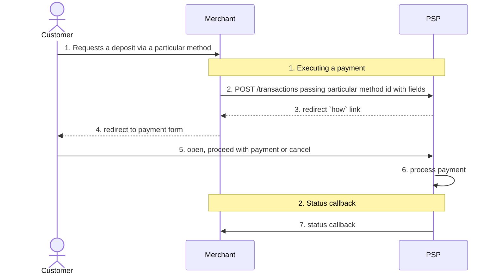
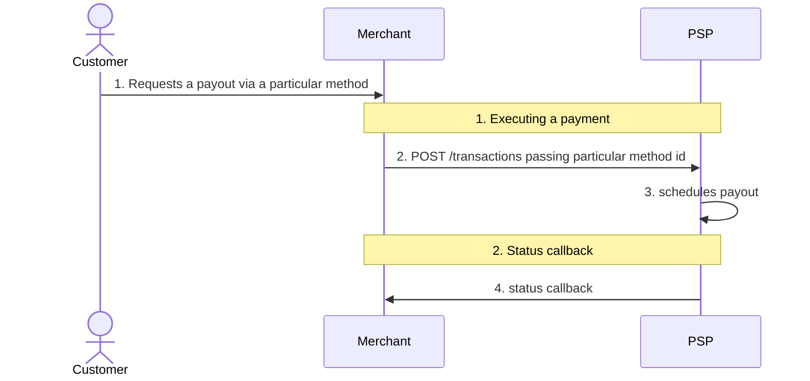

# APS Payments Skill Implementation Plan

> **For agentic workers:** REQUIRED SUB-SKILL: Use superpowers:subagent-driven-development (recommended) or superpowers:executing-plans to implement this plan task-by-task. Steps use checkbox (`- [ ]`) syntax for tracking.

**Goal:** Vendor the APS merchant integration docs into a project-local Claude skill, alongside a hand-written record of where the live API departs from them.

**Architecture:** A generator script fetches each Docusaurus page, strips presentational chrome from the `<article>` element, and converts it to GitHub-flavoured markdown with pandoc. Diagram images, which carry no information as links, are transcribed into mermaid and prose in place. A thin `SKILL.md` routes to the resulting references and loads automatically when someone works on APS code.

**Tech Stack:** Python 3 with `beautifulsoup4` (installed, 4.15.0), `pandoc` 3.9 (installed at `/opt/homebrew/bin/pandoc`), git.

**Spec:** [`docs/superpowers/specs/2026-08-11-aps-payments-skill-design.md`](../specs/2026-08-11-aps-payments-skill-design.md)

## Global Constraints

- Everything lands under `.claude/skills/aps-payments/`. This directory does not
  yet exist in the repo; it is committed, not ignored.
- No source file under `src/` is modified. This plan adds documentation only.
- Mirrors are **generated**, never hand-edited, with one exception: the diagram
  transcriptions of Task 2. Any hand-edit outside those marked regions will be
  destroyed by the next regeneration.
- Every `quirks.md` entry cites both a passage in a mirrored doc and a
  `file:line` or commit in this repo. Entries that cannot be grounded on both
  sides are dropped, not guessed.
- The PNG diagram images are **not** committed.
- Verification counts are exact, not minimums. They were measured against the
  live pages on 2026-08-11 and are reproduced in each task.

---

### Task 1: Conversion pipeline and both mirrors

**Files:**
- Create: `.claude/skills/aps-payments/references/SOURCES.md`
- Create: `.claude/skills/aps-payments/references/h2h.md` (generated)
- Create: `.claude/skills/aps-payments/references/fpf-v3.md` (generated)
- Scratch (not committed): `/tmp/aps-mirror.py`

**Interfaces:**
- Consumes: nothing.
- Produces: `references/h2h.md` and `references/fpf-v3.md`, both clean GFM with
  markdown image links still in place at the seven diagram positions. Task 2
  replaces those image links. `SOURCES.md` holds the generator script as a
  fenced `python` block under the heading `## Regenerating`, and the checks as a
  fenced `bash` block under `## Verifying`.

- [ ] **Step 1: Create the skill directory**

```bash
mkdir -p .claude/skills/aps-payments/references
```

- [ ] **Step 2: Write the verification script and watch it fail**

Save as `/tmp/aps-verify.sh` and make it executable:

````bash
#!/usr/bin/env bash
# Verifies the APS mirrors against counts measured from the live pages.
set -u
cd "$(git rev-parse --show-toplevel)/.claude/skills/aps-payments/references" || exit 1
status=0
check() { # name actual expected
  if [ "$2" = "$3" ]; then printf '  ok   %-22s %s\n' "$1" "$2"
  else printf '  FAIL %-22s got %s want %s\n' "$1" "$2" "$3"; status=1; fi
}
for spec in "h2h 14 27 4" "fpf-v3 11 21 3"; do
  set -- $spec
  f="$1.md"
  echo "$f"
  if [ ! -f "$f" ]; then echo "  FAIL missing"; status=1; continue; fi
  check "raw html lines" "$(grep -c '^<[a-z]' "$f")" 0
  check "table headers"  "$(grep -cE '^\|[-: |]+\|$' "$f")" "$2"
  check "code fences"    "$(( $(grep -c '^```' "$f") / 2 ))" "$3"
  check "diagram slots"  "$(( $(grep -c '^!\[' "$f") + $(grep -c '^<!-- source:' "$f") ))" "$4"
done
grep -q 'crypto/hmac' h2h.md   || { echo "FAIL h2h.md: go hmac sample missing"; status=1; }
grep -q 'crypto/hmac' fpf-v3.md || { echo "FAIL fpf-v3.md: go hmac sample missing"; status=1; }
exit $status
````

Run: `chmod +x /tmp/aps-verify.sh && /tmp/aps-verify.sh`
Expected: FAIL — `h2h.md` / `FAIL missing` for both files, exit 1.

The `diagram slots` check counts image links **plus** transcription markers, so
it passes in Task 1 (4 and 3 images) and still passes in Task 2 once those
images become `<!-- source: … -->` markers. That is deliberate: it catches a
diagram silently vanishing during transcription.

- [ ] **Step 3: Write the generator script**

Save as `/tmp/aps-mirror.py`:

```python
#!/usr/bin/env python3
"""Mirror an APS Docusaurus doc page to clean GitHub-flavoured markdown."""
import subprocess
import sys
import urllib.request

from bs4 import BeautifulSoup

url, out_path = sys.argv[1], sys.argv[2]

html = urllib.request.urlopen(url).read().decode("utf-8")
article = BeautifulSoup(html, "html.parser").find("article")
if article is None:
    sys.exit(f"no <article> element at {url}")

# Chrome that carries no information: breadcrumbs, heading anchors,
# copy-to-clipboard controls, and the mobile TOC (duplicates the headings).
for selector in (
    'nav[class*="breadcrumb"]',
    "ul.breadcrumbs",
    "a.hash-link",
    'div[class*="buttonGroup"]',
    'div[class*="tocCollapsible"]',
):
    for node in article.select(selector):
        node.decompose()

# Presentational attributes on links and images make pandoc bail out to raw
# HTML. Reduced to href/src/alt, they convert to real markdown.
for node in article.find_all("a"):
    node.attrs = {k: v for k, v in node.attrs.items() if k == "href"}
for node in article.find_all("img"):
    node.attrs = {k: v for k, v in node.attrs.items() if k in ("src", "alt")}

# Code block titles are load-bearing ("Initiate transaction", "Go") — keep the
# text as a bold caption before unwrapping the containers around it.
for node in article.select('div[class*="codeBlockTitle"]'):
    caption = BeautifulSoup("", "html.parser").new_tag("p")
    strong = BeautifulSoup("", "html.parser").new_tag("strong")
    strong.string = node.get_text(strip=True)
    caption.append(strong)
    node.replace_with(caption)

# Unwrap the presentational scaffolding around <pre>, innermost first.
for selector in (
    'div[class*="codeBlockContent"]',
    'div[class*="codeBlockContainer"]',
    'div[class*="theme-code-block"]',
    'div[class*="language-"]',
    'div[class*="theme-doc-markdown"]',
):
    for node in article.select(selector):
        node.unwrap()

result = subprocess.run(
    ["pandoc", "-f", "html", "-t", "gfm", "--wrap=none"],
    input=str(article), capture_output=True, text=True, check=True,
)
with open(out_path, "w") as handle:
    handle.write(result.stdout)
print(f"wrote {out_path}")
```

- [ ] **Step 4: Generate both mirrors**

```bash
cd .claude/skills/aps-payments/references
python3 /tmp/aps-mirror.py https://merchant.aps.money/developers/docs/h2h/integration h2h.md
python3 /tmp/aps-mirror.py https://merchant.aps.money/developers/docs/fpf-v3/integration fpf-v3.md
```

Expected: `wrote h2h.md` then `wrote fpf-v3.md`.

- [ ] **Step 5: Run verification and confirm it passes**

Run: `/tmp/aps-verify.sh`
Expected: every line `ok`, exit 0. Specifically `h2h.md` at 0 / 14 / 27 / 4 and
`fpf-v3.md` at 0 / 11 / 21 / 3.

If a count is off, do **not** hand-edit the markdown to make it pass — that
defeats regeneration. Fix the script's selectors and rerun step 4.

- [ ] **Step 6: Write `SOURCES.md`**

```markdown
# Sources

Vendored from the APS merchant documentation. Do not hand-edit `h2h.md` or
`fpf-v3.md` except inside the `<!-- source: … -->` transcription blocks —
everything else is overwritten on regeneration.

| File | Source URL | Fetched |
|---|---|---|
| `h2h.md` | https://merchant.aps.money/developers/docs/h2h/integration | 2026-08-11 |
| `fpf-v3.md` | https://merchant.aps.money/developers/docs/fpf-v3/integration | 2026-08-11 |

Generator: Docusaurus v3.0.1. Requires `pandoc` and Python `beautifulsoup4`.

**Not mirrored:** `https://merchant.aps.money/developers/docs/new-documentation/integration`
("Payment methods documentation"). The page server-renders a title and nothing
else; its body is client-rendered and unreachable without a browser. Re-check it
on each refresh in case APS starts server-rendering it.

Also not mirrored, as they hold no content: `docs/intro`, `docs/category/*`,
`markdown-page`, and `/`.

## Regenerating

Save the script below to `/tmp/aps-mirror.py`, then from this directory:

    python3 /tmp/aps-mirror.py https://merchant.aps.money/developers/docs/h2h/integration h2h.md
    python3 /tmp/aps-mirror.py https://merchant.aps.money/developers/docs/fpf-v3/integration fpf-v3.md

Then re-apply the diagram transcriptions — regeneration restores the plain
image links. `git diff` shows both what APS changed and which transcriptions
need redoing.

<!-- paste the exact contents of /tmp/aps-mirror.py from Task 1 Step 3 here,
     inside a ```python fence -->

## Verifying

<!-- paste the exact contents of /tmp/aps-verify.sh from Task 1 Step 2 here,
     inside a ```bash fence -->
```

Replace both `<!-- paste … -->` comments with the real file contents before
saving. The two scripts must match what was actually run in steps 2–4
character for character; a `SOURCES.md` whose script differs from the one that
produced the mirrors is worse than none.

- [ ] **Step 7: Commit**

```bash
git add .claude/skills/aps-payments/references/
git commit -m "docs(aps): vendor the APS integration guides as markdown mirrors

Generated from the two Docusaurus pages with the script recorded in
SOURCES.md. Verified complete: h2h 14 tables / 27 code blocks, fpf-v3
11 / 21, no residual HTML in either.

Vendored rather than fetched on demand so upstream changes surface as
diffs — APS publishes no changelog or versioning."
```

---

### Task 2: Transcribe the diagrams

**Files:**
- Modify: `.claude/skills/aps-payments/references/h2h.md` (4 image links)
- Modify: `.claude/skills/aps-payments/references/fpf-v3.md` (3 image links)

**Interfaces:**
- Consumes: the two mirrors from Task 1, with markdown image links intact.
- Produces: the same files with every `` line replaced by a
  `<!-- source: <basename>.png -->` marker followed by mermaid or prose. No
  `^!\[` lines remain in either file.

Each replacement takes this shape — marker, then content, so a later
regeneration can find what was hand-written:

```
<!-- source: Sequence_Diagram_For_Deposit.png -->
```mermaid
…
```
```

- [ ] **Step 1: Replace the h2h deposit sequence diagram**

In `h2h.md`, replace the line beginning
`![Sequence Diagram for Deposit](/developers/assets/images/Sequence_Diagram_For_Deposit-`
with:

````
<!-- source: Sequence_Diagram_For_Deposit.png -->

````

- [ ] **Step 2: Replace the h2h remit sequence diagram**

Replace the line beginning
`![Sequence Diagram for Remit](/developers/assets/images/Sequence_Diagram_For_Payout-`
with:

````
<!-- source: Sequence_Diagram_For_Payout.png -->

````

- [ ] **Step 3: Replace the onboarding steps diagram in `h2h.md`**

Replace the line beginning
`. Replace the line
beginning `![integration steps](/developers/assets/images/steps-` with the exact
block from Step 3.

- [ ] **Step 6: Replace the fpf-v3 deposit sequence diagram**

Replace the line beginning
` $(grep -c '^!\[' fpf-v3.md)"
echo "transcription markers: $(grep -c '^<!-- source:' h2h.md) $(grep -c '^<!-- source:' fpf-v3.md)"
echo "mermaid blocks:        $(grep -c '^```mermaid' h2h.md) $(grep -c '^```mermaid' fpf-v3.md)"
/tmp/aps-verify.sh
````

Expected: remaining image links `0 0`; transcription markers `4 3`; mermaid
blocks `2 2`; and `/tmp/aps-verify.sh` still exits 0 — its fence count must
still read 27 and 21, since mermaid fences were added in place of image lines
and would push those numbers up if a fence were left unbalanced.

Note: the verify script counts a mermaid block as a code fence pair, so adding
2 mermaid blocks per file **will** change the fence totals to 29 and 23. Update
the two expected values in `/tmp/aps-verify.sh` from `27` to `29` and `21` to
`23`, and make the same edit in the `## Verifying` block of `SOURCES.md`, so the
committed checker matches the committed files.

- [ ] **Step 9: Commit**

```bash
git add .claude/skills/aps-payments/references/
git commit -m "docs(aps): transcribe the diagram images into the mirrors

The seven PNGs in the APS guides are unreadable as links in a text
reference. Sequence diagrams become mermaid, the onboarding chart a
numbered list, the hosted-page screenshot prose.

The FPF remit diagram is the reason this is worth doing by hand: the
merchant must answer a POST /confirmation_callback with 200 before the
PSP schedules the payout, and that step appears nowhere in the page's
prose."
```

---

### Task 3: Write `quirks.md`

**Files:**
- Create: `.claude/skills/aps-payments/references/quirks.md`
- Read for citation: `src/Drivers/Aps/ApsClient.php`, `src/Drivers/Aps/ApsProvider.php`,
  `src/Drivers/Aps/ApsAdapter.php`, `src/Http/Controllers/Webhooks/ApsWebhookController.php`,
  `config/cashier-core.php`

**Interfaces:**
- Consumes: the mirrors from Tasks 1–2, for the "what the docs say" half of each entry.
- Produces: `references/quirks.md`, twelve numbered entries, each ending in a
  `file:line` or commit citation. `SKILL.md` (Task 4) links to it.

- [ ] **Step 1: Verify every citation before writing**

Line numbers drift. Confirm each range still covers what the entry claims:

```bash
sed -n '42,70p'   src/Drivers/Aps/ApsClient.php    # getTransaction + 404 comment
sed -n '96,111p'  src/Drivers/Aps/ApsClient.php    # verifySignature + callback secret
sed -n '68,98p'   src/Http/Controllers/Webhooks/ApsWebhookController.php
sed -n '218,231p' src/Drivers/Aps/ApsProvider.php  # verifyRawSignature
sed -n '31,39p'   src/Drivers/Aps/ApsProvider.php  # one account per product
sed -n '86,96p'   src/Drivers/Aps/ApsProvider.php  # HttpClientException catch
sed -n '118,142p' src/Drivers/Aps/ApsProvider.php  # customerFacingUrl
sed -n '18,38p'   src/Drivers/Aps/ApsAdapter.php   # fromProviderResponse
sed -n '60,84p'   src/Drivers/Aps/ApsAdapter.php   # fromWebhook
sed -n '86,101p'  src/Drivers/Aps/ApsAdapter.php   # mapStatus
sed -n '32,38p'   config/cashier-core.php          # connection example
git show --oneline -s 3fe3673
```

If a range has shifted, use the corrected one in the entry. Do not write an
entry whose citation you have not opened.

- [ ] **Step 2: Write the file**

````markdown
# APS: docs vs. reality

Where the live API departs from the mirrored documentation, or where the docs
are silent and we learned it the hard way. Each entry cites where we handle it.

This file is hand-written. It is the only thing here the mirrors cannot tell
you, so keep it to genuine divergences — do not restate what `h2h.md` and
`fpf-v3.md` already say.

## 1. There is no `/transactions/{id}` lookup route

The transaction GUID sits directly under the merchant GUID:
`GET /api/v3/{merchantGuid}/{transactionId}`. The plausible-looking collection
path is not routed, and APS answers it with a plain-text `404 page not found` —
indistinguishable from an unknown transaction once the status is discarded. Any
lookup failure is therefore logged with its status rather than swallowed.

`src/Drivers/Aps/ApsClient.php:42-70`

## 2. Callbacks are signed with the callback secret, not the app secret

Outbound requests authenticate with `X-App-Token` and `X-App-Secret`. Callbacks
are HMAC-SHA256 over the **raw** body, delivered in `X-Signature`, signed with a
separately issued callback secret. The two are easy to conflate, and doing so
rejects every callback. Where no callback secret is configured we fall back to
the app secret, which fails closed in exactly that way — so set
`APS_CALLBACK_SECRET`.

Both guides ship a Go reference implementation of this check, including the
warning to use a constant-time comparison. Ours uses `hash_equals`.

`src/Drivers/Aps/ApsClient.php:96-111`

## 3. Callbacks carry no merchant identifier

Every APS account posts to the same callback URL, and nothing in the payload
says which account sent it. The sender is identified by trying each configured
account's callback secret until one verifies — the match is itself the proof.
The matched connection then rides along to the job, so the payload is parsed
under the credentials that signed it.

`src/Http/Controllers/Webhooks/ApsWebhookController.php:68-98`,
`src/Drivers/Aps/ApsProvider.php:218-231`

## 4. One APS account per product

APS issues a separate merchant GUID, app key and callback secret per product.
Binance Pay is not reachable with the card account's credentials. Each account
is its own entry in `config('cashier-core.connections')`, and the account is
chosen by which connection a payment method names.

`src/Drivers/Aps/ApsProvider.php:31-39`

## 5. The BANKCARD `how` URL points at the wrong host for humans

The `how` field returns the PCI gateway's JSON API host, which shows the
customer a raw JSON payment session instead of the card form. The form SPA
serves the identical path from a sibling host, so only the host is rewritten —
path and query are APS's and stay untouched. Hosts absent from
`checkout_host_map` pass through unchanged, making this inert for every other
method and for the day APS returns the form URL directly.

`src/Drivers/Aps/ApsProvider.php:118-142`

## 6. Two status vocabularies, sometimes in the same payload

Fiscal statuses: `pending`, `canceled`, `expired`, `done`, `failed`.
Deposit (sep31) statuses: `pending_sender`, `pending_external`, `completed`,
`error`. Read `status` first and fall back to `sep31_status`.

`src/Drivers/Aps/ApsAdapter.php:86-101`

## 7. A downstream rejection arrives as `canceled`, not `failed`

APS reports a PSP-side rejection as fiscal status `canceled`, with the real
reason in `external_message` — for example `"512: Desktop devices are not
supported"`. Treating only `failed` as carrying an error message left customers
and support staring at a bare "Canceled" while the reason sat unread in
metadata. The error message is carried on both statuses.

`src/Drivers/Aps/ApsAdapter.php:60-84`, commit `3fe3673`

## 8. Callback payloads nest under a top-level `payload` key

Status callbacks wrap everything in `payload`. Retrieve responses may or may
not, so both paths unwrap defensively with `$payload['payload'] ?? $payload`.

`src/Drivers/Aps/ApsAdapter.php:43-46`, `src/Drivers/Aps/ApsAdapter.php:64-67`

## 9. Money and checkout field names

`amount_in` is what the customer pays, `amount_out` what the merchant receives,
`customer_fee` the end-user's share. The hosted checkout URL is `how` — not
`url`, `link`, or `redirect_url`.

`src/Drivers/Aps/ApsAdapter.php:18-38`

## 10. Two environments, separate credentials

Staging is `https://fpf-api.armenotech.net`, production
`https://fpf-api.proc-gw.com`. Credentials are not shared between them, and both
are issued as one-time email links. Note the production host is FPF-flavoured
but serves the H2H `/api/v3` API too — it is the default `base_url`.

`src/Drivers/Aps/ApsProvider.php:49`

## 11. Documented `retryable` flag on card errors, unused here

The H2H guide's error table marks card-level failures (empty holder, expired
card, invalid CSC, bad check digit …) with `retryable: true` and a specific
`external_status`. Our charge path catches the transport failure and throws a
generic `PaymentProcessingException` without inspecting either field, so a
retryable card error is currently indistinguishable from a hard failure. Known
gap, not a deliberate decision — see the error table in `h2h.md`.

`src/Drivers/Aps/ApsProvider.php:86-96`

## 12. Connection keys the package's own config example omits

The driver reads `callback_secret`, `deposit_method`, `redirect_url`,
`webhook_url` and `checkout_host_map`. None appear in the commented example
block in `config/cashier-core.php:32-38`, which shows only `driver`, `base_url`,
`merchant_guid`, `app_token` and `app_secret`. Anyone configuring a connection
from that example alone gets a driver that throws on `charge()` for the missing
`deposit_method` and silently fails callback verification.

Closing that gap is a code change, out of scope for the skill; recorded here so
it is not lost.

`config/cashier-core.php:32-38`
````

- [ ] **Step 3: Verify every citation resolves**

```bash
cd "$(git rev-parse --show-toplevel)"
grep -oE '`(src|config)/[^`]+\.php:[0-9]+(-[0-9]+)?`' \
  .claude/skills/aps-payments/references/quirks.md |
  tr -d '`' | while IFS=: read -r file lines; do
    start=${lines%%-*}
    total=$(wc -l < "$file")
    if [ ! -f "$file" ]; then echo "MISSING FILE $file"
    elif [ "$start" -gt "$total" ]; then echo "OUT OF RANGE $file:$lines (file has $total)"
    else echo "ok $file:$lines"; fi
  done
```

Expected: every line `ok`, no `MISSING FILE` or `OUT OF RANGE`.

- [ ] **Step 4: Commit**

```bash
git add .claude/skills/aps-payments/references/quirks.md
git commit -m "docs(aps): record where the APS API departs from its docs

Twelve entries collected from the driver's own comments and commit
history, each citing the code that handles it. Two are gaps rather
than divergences: the documented retryable flag on card errors is
never inspected, and five connection keys the driver requires are
absent from the config example."
```

---

### Task 4: Write `SKILL.md` and verify end to end

**Files:**
- Create: `.claude/skills/aps-payments/SKILL.md`

**Interfaces:**
- Consumes: all four files in `references/`.
- Produces: the skill entry point. Frontmatter `name` must be `aps-payments`,
  matching the directory name.

- [ ] **Step 1: Write `SKILL.md`**

```markdown
---
name: aps-payments
description: Use when working with the APS payment gateway (merchant.aps.money) — the Aps driver, ApsClient/ApsProvider/ApsAdapter, APS webhooks and callbacks, or APS deposits, remits, refunds, balance and payment-method lookups. Covers the Host-to-Host and Fast Payment Flow v3 API contracts.
---

# APS Payments

APS publishes no OpenAPI spec, no changelog and no API versioning. This skill
vendors its two integration guides so the contract is available offline and
upstream changes show up as diffs.

## References

Read the one you need; they are large.

- `references/quirks.md` — **start here.** Where the live API departs from its
  own docs, and where the docs are silent. Twelve entries, each citing the code
  in this package that handles it.
- `references/h2h.md` — Host-to-Host guide. The `/api/v3` surface this package
  actually uses: `/info`, `POST /transactions`, status lookup, refunds, balance,
  transaction history, and the card error table with `retryable` flags.
- `references/fpf-v3.md` — Fast Payment Flow v3 guide, APS's hosted checkout UI.
  Relevant when touching the `how` URL or `checkout_host_map`.
- `references/SOURCES.md` — source URLs, fetch date, and the commands to
  regenerate and verify the mirrors.

## Before you change anything

Five things that have already cost time:

1. **Callbacks are signed with the callback secret, not the app secret.**
   HMAC-SHA256 over the raw body, in `X-Signature`. Conflating the two rejects
   every callback.
2. **Callbacks carry no merchant identifier.** With several APS accounts on one
   URL, the sender is found by trying each account's callback secret.
3. **A rejected payment arrives as `canceled`, not `failed`,** with the reason in
   `external_message`.
4. **There is no `/transactions/{id}` route.** It is
   `/api/v3/{merchantGuid}/{transactionId}`; the wrong path returns a plain-text
   `404 page not found`.
5. **Two status vocabularies** — fiscal (`done`, `canceled`, `expired`, …) and
   sep31 (`completed`, `pending_external`, …) — can appear in one payload.

## The code

- `src/Drivers/Aps/ApsClient.php` — HTTP surface, auth headers, signature check
- `src/Drivers/Aps/ApsProvider.php` — charge, refund, retrieve, per-account config
- `src/Drivers/Aps/ApsAdapter.php` — response/callback → cashier-core objects,
  status mapping
- `src/Http/Controllers/Webhooks/ApsWebhookController.php` — callback entry point,
  account matching, replay guard

## Refreshing

APS changes the docs without announcement. Follow `## Regenerating` in
`references/SOURCES.md`, then read `git diff` — that diff is the changelog APS
does not publish. Regeneration restores the plain image links, so the diagram
transcriptions must be re-applied; they are marked `<!-- source: … -->`.
```

- [ ] **Step 2: Check the frontmatter and length**

```bash
cd .claude/skills/aps-payments
head -4 SKILL.md
echo "lines: $(wc -l < SKILL.md)"
```

Expected: frontmatter opens on line 1 with `---`, `name: aps-payments` on line 2,
a `description:` on line 3 as a single unbroken line, `---` on line 4. Line count
under 80.

- [ ] **Step 3: Full verification against the spec**

````bash
cd "$(git rev-parse --show-toplevel)"
ls -R .claude/skills/aps-payments
/tmp/aps-verify.sh
grep -c '^## ' .claude/skills/aps-payments/references/quirks.md   # expect 12
grep -c '^```mermaid' .claude/skills/aps-payments/references/*.md # expect 2 and 2
git status --short
````

Expected: five files present (`SKILL.md` plus four references); verify script
exits 0; twelve quirks headings; two mermaid blocks per mirror; `git status`
clean apart from the new `SKILL.md`. No PNG files anywhere under `.claude/`.

- [ ] **Step 4: Confirm the skill is discoverable**

Start a fresh session in this repo and ask a question the skill should answer,
such as "how does APS sign its callbacks?". The `aps-payments` skill should be
offered or invoked without being named. If it is not, the `description` is too
narrow — widen it with the concrete symbols someone would have open, and repeat.

- [ ] **Step 5: Commit**

```bash
git add .claude/skills/aps-payments/SKILL.md
git commit -m "docs(aps): add the aps-payments skill entry point

Routes to the vendored guides and the quirks file, and front-loads the
five traps that have already cost time. Fires on the Aps driver
classes, APS webhooks, and the deposit/remit/refund operations."
```

---

## Self-review notes

**Spec coverage.** Every section of the spec maps to a task: source survey and
mirror generation → Task 1; diagram transcription → Task 2; `quirks.md` → Task 3;
trigger, layout and staleness → Task 4. The spec's six verification criteria are
covered by `/tmp/aps-verify.sh` (1–3), Task 2 Step 8 (4), Task 3 Step 3 (5), and
Task 4 Step 3 (6).

**Two deviations from the spec, both deliberate:**

1. The spec listed **eleven** quirks entries. This plan has twelve — building the
   mirrors surfaced the H2H card-error table with its `retryable` flags, which
   the charge path never inspects. That is a genuine docs-vs-code divergence and
   meets the admission rule, so it was added as entry 11.
2. The spec's fence counts (27 / 21) are correct for Task 1 but go stale the
   moment Task 2 adds mermaid blocks. Task 2 Step 8 updates the checker to
   29 / 23 rather than leaving a check that must be ignored. A verification
   command everyone knows to skip is worse than no command.

**Known fragility.** The diagram transcriptions are the one hand-written part of
a generated file, and regeneration silently reverts them. `SOURCES.md` and
`SKILL.md` both say so, and the `<!-- source: … -->` markers make the affected
regions greppable, but nothing enforces it. This was raised and accepted at spec
review.
